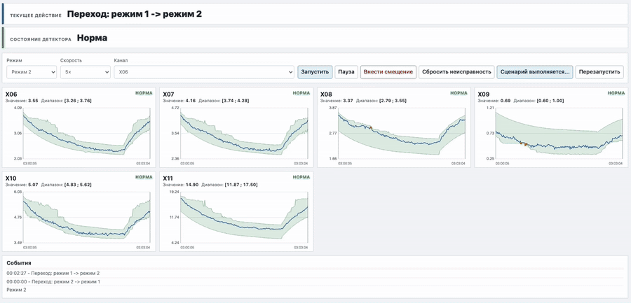

# Sensor Anomaly Detector

Система обнаружения аномалий в многоканальной телеметрии оборудования, разработанная на основе обучения ML-моделей.

При нормальной работе оборудования значения разных каналов образуют характерные сочетания. Поэтому корректность отдельного показания определяется не только тем, находится ли оно в допустимом диапазоне само по себе, но и тем, насколько оно соответствует комплексному сочетанию остальных параметров системы.

Модели обучаются на статистике нормальной работы и для каждого контролируемого канала рассчитывают динамический диапазон ожидаемых значений. Устойчивый выход показания за этот диапазон рассматривается как аномалия датчика. Такой подход позволяет находить статистически нетипичные показания, а не только выход за заранее заданные уставки оборудования.


## Как устроена система

Контролируются 6 каналов телеметрии: X06–X11. Для каждого используются две модели.

**Strict** — линейная квантильная регрессия на небольшом наборе базовых управляющих признаков.

**Full** — CatBoost с MultiQuantile, использующий тот же базовый контекст и дополнительные соседние каналы, кроме самого контролируемого.

Всего используется:

```text
6 каналов × 2 модели = 12 моделей
```

Full лучше учитывает взаимосвязи между параметрами, но сильнее зависит от корректности соседних датчиков. Если один из них начинает выдавать неправильные значения, это может смещать прогнозы других моделей и создавать каскадные ложные срабатывания.

Strict использует более устойчивый набор признаков и меньше зависит от соседних измерений, но строит более грубый диапазон.

Основная тревога формируется только тогда, когда Strict и Full одновременно считают показание отклонением в одну сторону.


## Демонстрация работы детектора

Демонстрация показана на небольшом фрагменте телеметрии. Сначала меняется режим работы системы и видно, как вслед за изменением состояния и связанных параметров перестраиваются ожидаемые диапазоны значений.

Затем для нескольких каналов искусственно вносятся характерные отклонения, имитирующие неисправность датчика, и показано, как детектор обнаруживает эти отклонения.

Демонстрация зациклена.



## Как определяется ожидаемый диапазон

Модели предсказывают не одно «правильное» значение, а нижнюю и верхнюю границы ожидаемого диапазона.

Например:

```text
Strict: [8.1; 9.4]
Full:   [8.3; 9.7]
```

Для отображения используется общий диапазон:

```text
lower = min(strict_lower, full_lower)
upper = max(strict_upper, full_upper)
```

В этом примере итоговый диапазон:

```text
[8.1; 9.7]
```

Если фактическое значение находится ниже итоговой нижней границы или выше итоговой верхней границы, обе ветки одновременно считают его отклонением в одну сторону.

Чтобы одиночный выброс или кратковременный шум не приводили к тревоге, отклонение должно сохраняться 5 секунд подряд.


## Данные и обучение

Модели обучались и проверялись на синтетической многоканальной телеметрии с частотой 1 Гц.

Данные были разделены по времени:

```text
Обучение:            30 дней — 2 592 000 строк
Валидация:           21 день — 1 814 400 строк
Итоговая проверка:   30 дней — 2 592 000 строк
```

Обучающая выборка использовалась для обучения моделей, валидационная — для калибровки и выбора конфигурации, итоговая тестовая — для независимой итоговой проверки.

В репозитории представлен демонстрационный фрагмент `data/demo.csv` из 900 последовательных измерений с частотой 1 Гц. Он используется только для запуска готовой системы и не участвует в обучении опубликованных моделей.

Названия признаков обезличены:

```text
X01 ... X12
```

## Разработка моделей

Процесс разработки и обучения приведён в `project.ipynb`.

В notebook последовательно показаны:

- подготовка данных и признаков;
- обучение Strict и Full;
- линейная квантильная регрессия и CatBoost MultiQuantile;
- калибровка диапазонов;
- сравнение кандидатов;
- оценка ложных тревог;
- проверка каскадных ложных срабатываний;
- оценка обнаружения неисправностей датчиков;

Обученные модели сохранены в каталоге `models/` и используются демонстрацией напрямую.

## Результаты

Основная итоговая проверка проводилась на отдельной 30-дневной итоговой тестовой выборке, которая не использовалась при обучении, калибровке или выборе итоговых моделей.

На этом наборе система обнаружила **6 из 7 предусмотренных сценариев неисправности датчиков для X06–X11**.

На нормальных процессных событиях за тот же период было зафиксировано **13 эпизодов ложного срабатывания** общей длительностью **658 секунд**.

Для каналов X06–X11 среднее покрытие ожидаемых диапазонов на валидационной выборке составило **99,5%**. При выборе моделей также учитывалась ширина диапазона: слишком широкий интервал даёт высокое покрытие, но хуже выявляет аномалии.

Отдельно проверялась устойчивость к каскадным ложным тревогам — ситуациям, когда неисправность одного датчика вызывает ложные срабатывания на соседних каналах. На валидационной выборке одна Full-ветка дала **18 каскадных эпизодов** общей длительностью **94 127 секунд**. После применения Strict + Full Consensus каскадных срабатываний не осталось — **0 эпизодов**.

Такой результат достигается не бесплатно: тревога формируется только тогда, когда Strict и Full одновременно видят отклонение в одну сторону. Это снижает число каскадных ложных тревог, но делает детектор более консервативным и может снижать чувствительность к слабым или плохо отделимым отклонениям.

На валидационной выборке среднее время обнаружения по 7 сценариям составило около **11,5 минуты**. На показатель сильно повлиял X11 с задержкой **4391 с (≈73 мин)**; для остальных шести сценариев среднее время обнаружения составляло около **74 секунд**.

На итоговой тестовой выборке именно X11 оказался единственным пропущенным сценарием. Вероятно, это связано с сочетанием более широкого эффективного диапазона при Consensus, недостаточной обобщающей способности моделей для поведения X11 на новых данных и, возможно, более слабой статистической связи этого канала с остальной телеметрией. Для улучшения результата X11 требуется отдельный подбор более информативных признаков и временного контекста, а при необходимости — более гибкой модели и отдельной настройки диапазонов.

Итого:

- обнаружено неисправностей на независимой итоговой тестовой выборке: **6 из 7**;
- ложных тревог на нормальных процессных событиях: **13 эпизодов за 30 дней**;
- среднее покрытие ожидаемых диапазонов на валидационной выборке: **99,5%**;
- каскадных ложных тревог после Consensus на валидационной выборке: **0**;
- среднее время обнаружения без X11 на валидационной выборке: **≈74 с**.

Подробные результаты по каждому каналу, включая Full / Strict / Consensus, ширину диапазонов, interval score и задержки обнаружения, приведены в `project.ipynb`.

## Демонстрация

В интерфейсе можно:

- наблюдать телеметрию и рассчитанные диапазоны;
- менять состояние системы;
- искусственно вносить смещение в выбранный канал;
- наблюдать реакцию детектора;
- сбрасывать внесённое отклонение;
- запускать автоматический сценарий.

Срабатывания не прописаны заранее в интерфейсе. Данные проходят через сохранённые модели и обычную логику детектора.

## Запуск

Требуется Python 3.11.

```bash
git clone https://github.com/evgenfosgen/sensor-anomaly-detector.git
cd sensor-anomaly-detector

python3 -m venv .venv
source .venv/bin/activate

python -m pip install -r requirements.txt
python demo.py
```

После запуска открыть:

```text
http://127.0.0.1:8000
```

Дополнительное обучение для запуска демонстрации не требуется — 12 моделей уже находятся в репозитории.

## Структура репозитория

```text
.
├── README.md
├── LICENSE
├── project.ipynb
├── requirements.txt
├── config.json
├── demo.py
│
├── src/
│   ├── __init__.py
│   ├── simulator.py
│   ├── models.py
│   └── detector.py
│
├── data/
│   └── demo.csv
│
├── models/
│   ├── 12 сохранённых моделей
│   └── model_info.json
│
└── assets/
    ├── index.html
    └── demo.gif
```

`project.ipynb` — процесс разработки, обучения, сравнения и оценки моделей.

`src/models.py` — загрузка моделей и расчёт квантильных диапазонов.

`src/detector.py` — логика Consensus, подтверждение отклонения.

`src/simulator.py` — генерация телеметрии для интерактивной демонстрации.

## Ограничения

Система проверялась на синтетической телеметрии. Полученные метрики относятся к этому набору данных и выбранным сценариям неисправностей.

Для переноса на другое оборудование потребуются его исторические данные и обучение на них моделей.
